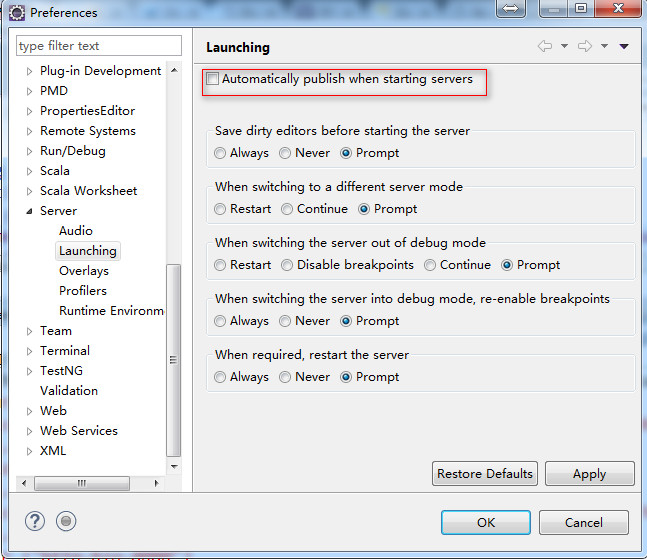

eclipse下配置Tomcat时server.xml和content.xml自动还原问题


但是当我们修改完后重启Tomcat服务器时发现xml文件又被还原了，修改无效果。

为什么会还原？

Tomcat服务器在Eclipse中启动时，会自动发布Eclipse中部署的项目，但是我的项目是自己手动在外面部署的，Eclipse只认得在它里面部署的项目，因此它会创建一个新的server.xml文件覆盖原来的文件，里面只有Eclipse中部署的项目。

解决方法一：

设置Ecplise，取消掉自动发布功能。

依次选择 Window -> Preferences -> Server -> Launching,取消Automatically publish wen starting servers，点击OK，搞定。



解决方法二：

Ecplise项目中有一个Server项目，有一个Tomcat v7.0 Server at localhost-config,

里面也有server.xml和content.xml，替换成你修改后的文件。Tomcat重新发布时会用这里的配置文件覆盖Tomcat下的conf下的文件。


设置Tomcat中WebApp的启动顺序,就是设置Context的顺序。

```xml
<Context docBase="App1" path="/App1" reloadable="true" source="org.eclipse.jst.jee.server:App1"/>

<Context docBase="App2" path="/App2" reloadable="true" source="org.eclipse.jst.jee.server:App2"/>

```
